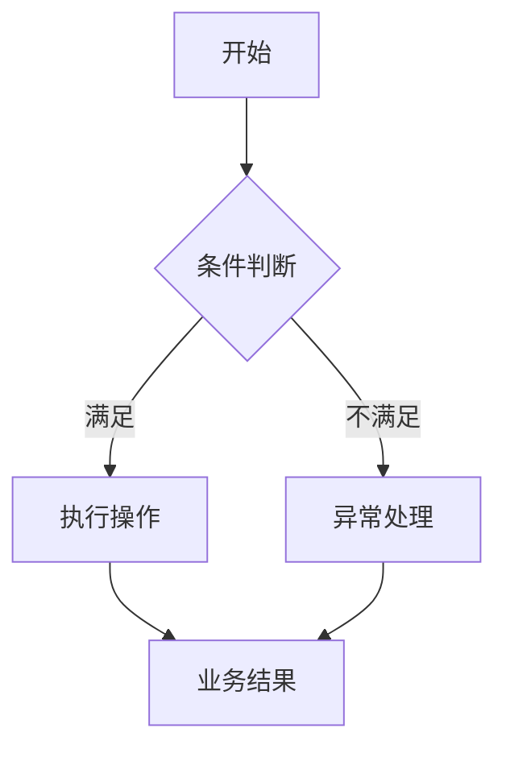
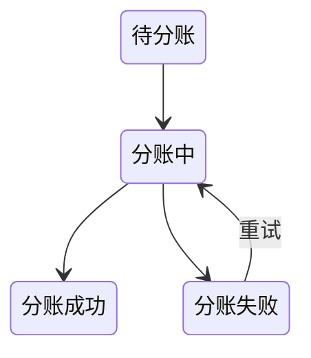

# PRD 模板

## 一、需求背景

简要说明：

* 当前业务现状
* 当前存在的问题及发生场景
* 本次需求解决范围

要求：

* 只描述与本次需求相关的信息
* 不提前展开功能方案
* 未明确的信息进入「待确认事项」，不得自行假设

---

## 二、需求目标

明确本次需求希望达到的业务结果。

要求：

* 每条目标独立表达
* 描述结果，不描述技术实现
* 避免「优化体验」「提升效率」等不可验证表述

示例：

* 支持不同景区商家配置独立结算周期
* 支持查询分账失败原因并重新发起
* 明确配置变更后的生效范围

---

## 三、核心业务流程

使用 Mermaid 描述主要业务链路，仅表达关键节点、判断条件和业务结果。

存在多个独立流程时可拆分绘制。

---

## 四、需求功能清单

用于确认本期范围，并作为功能详述索引。

| ID  | 终端 | 模块   | 功能     | 描述             |
| --- | -- | ---- | ------ | -------------- |
| F01 | 后台 | 收款配置 | 溢价比例配置 | 支持配置景区商家溢价自留比例 |
| F02 | 后台 | 结算配置 | 结算周期配置 | 支持配置日结、周结、月结   |
| F03 | 后台 | 结算中心 | 分账失败重试 | 支持查看失败原因并重新发起  |

要求：

* 多功能需求使用全 PRD 唯一功能 ID
* 页面或模块变化后不重新编号
* 一个功能对应一个独立业务能力
* 与第五章功能详述一一对应
* 本章节不展开详细规则

---

# 五、需求功能详述

按照功能清单顺序描述，可按页面或模块分组。

---

## 5.x F01｜页面 / 功能名称

### 5.x.1 功能说明

用 1～2 句话说明：

* 提供什么能力
* 解决什么业务问题

不重复需求背景，不描述技术实现。

---

### 5.x.2 用户操作

描述用户完成该功能的主操作路径。

示例：

1. 进入「景区商家管理」
2. 打开「收款配置」
3. 设置溢价自留比例
4. 点击「保存」
5. 系统校验并保存配置

要求：

* 只描述主流程
* 无用户操作的系统任务填写「无」

---

### 5.x.3 页面 / 交互

有页面改动时明确页面展示及交互规则；无页面改动填写「无」。

字段较多时优先使用表格：

| 字段 / 控件 | 组件          | 必填 | 默认值 | 规则 / 交互         |
| ------- | ----------- | -- | --- | --------------- |
| 结算周期    | Radio       | 是  | 日结  | 日结 / 周结 / 月结    |
| 每周结算日   | Select      | 是  | 周一  | 选择周结时展示         |
| 每月结算日   | InputNumber | 是  | 1   | 选择月结时展示，范围 1～28 |

根据实际功能明确：

* 页面入口
* 控件类型
* 默认值 / 默认状态
* 必填、范围、单位、精度
* 显隐、联动、清空、禁用
* 可编辑条件
* 操作反馈及必要提示文案
* 保存后的刷新、返回、关闭或停留行为

只描述产品行为，不规定具体前端技术实现。

---

### 5.x.4 核心业务规则

重要规则使用唯一规则 ID。

**R01｜规则名称**

按照：

> 条件 → 判断 / 计算口径 → 结果

进行描述。

示例：

**R01｜比例范围**

溢价自留比例取值范围为 0%～100%，最多支持 2 位小数。

**R02｜比例上限**

所有参与方已配置溢价分成比例合计不得超过 100%。

**R03｜剩余溢价归属**

扣除全部已配置分成后的剩余溢价归景区商家所有。

涉及以下内容时必须明确对应规则：

* **计算**：公式、单位、精度、舍入方式
* **时间**：周期、起止时间、自然日 / 工作日
* **配置**：生效时间、生效范围、历史数据影响
* **权限**：不同角色可查看 / 可操作范围
* **优先级**：多条规则冲突时的处理顺序
* **重复操作**：重复提交、重试、删除的处理结果

一条规则只表达一个核心判断。

---

### 5.x.5 数据 / 状态变化

存在数据或状态变化时明确：

* 什么数据发生变化
* 什么时候生效
* 是否影响历史或关联数据
* 状态值及进入条件
* 允许执行的操作
* 状态如何流转

状态较多时使用表格：

| 状态   | 含义   | 进入条件   | 可执行操作 |
| ---- | ---- | ------ | ----- |
| 待分账  | 尚未发起 | 达到分账条件 | 发起分账  |
| 分账中  | 已提交  | 已发起分账  | 查看    |
| 分账成功 | 分账完成 | 返回成功   | 查看    |
| 分账失败 | 分账失败 | 返回失败   | 查看、重试 |

复杂状态可使用 Mermaid：

无数据或状态变化填写：

> 无

---

### 5.x.6 异常与边界

只描述需要产品明确处理方式的异常和边界。

| 场景        | 触发条件    | 系统处理   | 用户反馈        |
| --------- | ------- | ------ | ----------- |
| 比例小于 0    | 输入负数    | 禁止保存   | 提示比例不得小于 0% |
| 比例超过 100% | 保存校验失败  | 禁止保存   | 提示比例超过限制    |
| 重复提交      | 保存中再次点击 | 不重复提交  | 保持 Loading  |
| 保存失败      | 保存请求失败  | 保留当前输入 | 提示保存失败      |

重点覆盖实际存在的：

* 空值 / 临界值
* 重复操作
* 数据或状态冲突
* 删除 / 重试
* 历史数据
* 操作失败

不机械罗列纯技术异常。

---

### 5.x.7 验收标准

重要验收项使用唯一 ID，并能够直接转换为测试场景。

推荐使用 Given / When / Then：

**AC01｜正常场景**

Given 当前已配置比例合计为 60%
When 用户将景区自留比例设置为 20% 并保存
Then 保存成功，最终比例合计为 80%。

**AC02｜边界场景**

Given 当前已配置比例合计为 80%
When 用户新增 20% 配置
Then 允许保存。

**AC03｜异常场景**

Given 当前已配置比例合计为 80%
When 用户新增 30% 配置
Then 禁止保存，并提示比例合计不得超过 100%。

验收标准重点覆盖：

* 主流程
* 核心规则
* 关键交互 / 联动
* 状态变化
* 重要边界与异常
* 配置生效及历史数据影响

一个 AC 只验证一个主要结果。

---

# 六、非功能性需求

仅填写本次需求新增或特殊要求，无要求时填写：

> 无新增非功能性要求，沿用现有系统标准。

如有要求，直接按实际内容列出，不强制分类。

示例：

* 列表查询响应时间 P95 ≤ 2 秒
* 敏感账户信息默认脱敏
* 分账重试不得产生重复有效分账
* 已生成账单不因后续配置修改重新计算

要求必须可验证，不得自行补充指标。

---

# 七、待确认事项

记录尚未确定、且会影响产品、开发或测试的问题。

| ID  | 待确认事项        | 影响功能 | 状态  |
| --- | ------------ | ---- | --- |
| Q01 | 周结具体结算日      | F02  | 待确认 |
| Q02 | 配置修改是否影响当前账期 | F02  | 待确认 |

要求：

* 未确认事项不得作为正式规则
* 不允许自行推断
* 确认后同步更新正文
* 无待确认事项填写「无」

---

# PRD 编写约束

1. 多功能需求使用全局唯一 `Fxx`；重要规则使用 `Rxx`；重要验收项使用 `ACxx`。
2. 功能清单与功能详述必须一一对应，同一规则只定义一次。
3. 页面交互、业务规则、数据状态、异常和验收分开描述。
4. 金额、比例、数量、时间等必须明确业务口径。
5. 配置修改必须明确生效范围及历史数据影响。
6. 状态必须明确进入条件和流转条件。
7. 重试 / 删除必须明确允许条件及处理结果。
8. 页面字段涉及默认值、显隐、联动、禁用时必须明确。
9. 验收标准必须可直接转换为测试场景。
10. 未确定内容进入「待确认事项」，不得自行假设。
11. 禁止使用「按原逻辑」「正常处理」「合理展示」「视情况处理」等模糊描述。
12. PRD 描述业务要求和产品行为，不默认规定数据库、API、架构或代码实现。
13. 无实际内容填写「无」，不为了完整性强行扩写。
14. 优先使用短句、表格、列表和流程图，避免重复和大段文字。
