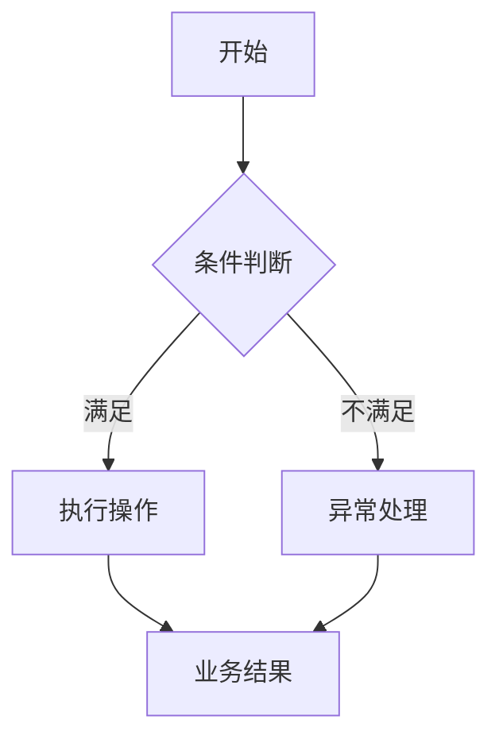

<!--
本文件是 PRD 骨架。写作提示与示例全部写在 HTML 注释内，输出时必须全部删除。
标注「条件章节 / 条件小节」的，无内容时整节删除，不要写「无」。
一级章节不得增删；功能详述的三节必填（说明与操作路径、规则、验收）。
-->

# <需求名称> PRD

> 版本 v1.0　·　日期 YYYY-MM-DD

---

## 一、需求背景与目标

<!-- 必填章节。只写与本次需求相关的信息，不展开功能方案，不描述技术实现。
不在这里写范围——范围以「三、功能清单」为唯一来源。 -->

**背景**

- 现状：<当前业务如何运转>
- 问题：<在什么场景下产生什么问题，影响到谁>

<!-- 示例：景区商家结算均按平台统一周期执行，商家无法按自身经营节奏申请结款。 -->

**目标**

- <目标 1>
- <目标 2>

<!-- 每条目标独立成条，描述业务结果而非技术实现，必须可验证。
禁止「优化体验」「提升效率」「提升用户满意度」等无法验证的表述。

示例：
- 支持不同景区商家配置独立结算周期
- 支持查询分账失败原因并重新发起
- 明确配置变更后的生效范围
-->

---

## 二、核心业务流程

<!-- 条件章节：不存在关键业务链路时整章删除。
只表达关键节点、判断条件与业务结果，不画页面跳转、不画技术时序。
存在多个互相独立的流程时，并列多个 mermaid 代码块。 -->

---

## 三、功能清单

<!-- 必填章节。仅用于确认本期范围与索引第四章，「描述」列控制在 20 字内，不展开任何规则。 -->

| ID  | 模块 | 功能 | 描述 |
| --- | -- | -- | -- |
| F01 |    |    |    |

<!--
编号规则：全 PRD 唯一且连续的 Fxx，页面或模块变化后不重新编号。
一个功能 = 一个独立业务能力，不按按钮、组件或接口拆分。
本表与「四、功能详述」必须一一对应，顺序一致。

示例：
| F01 | 收款配置 | 溢价比例配置 | 支持配置景区商家溢价自留比例 |
| F02 | 结算配置 | 结算周期配置 | 支持配置日结、周结、月结 |
| F03 | 结算中心 | 分账失败重试 | 支持查看失败原因并重新发起 |
-->

---

## 四、功能详述

<!-- 必填章节。按功能清单顺序逐个展开，可按页面或模块分组。 -->

### F01｜<功能名称>

**说明**：<1 句话，说明提供什么能力、解决什么业务问题。不重复需求背景，不描述技术实现>

**操作路径**：<A → B → C，只写主流程>

<!-- 系统任务无用户操作时写：**操作路径**：无（系统自动触发）。

示例：
**说明**：支持为景区商家单独配置溢价自留比例，替代原平台统一比例。
**操作路径**：景区商家管理 → 收款配置 → 设置溢价自留比例 → 保存
-->

#### 交互

<!-- 条件小节：无页面改动时不出现（不要写「无」）。有页面改动时必须出现。
只描述产品行为，不规定前端技术实现。
按实际情况明确：页面入口、控件类型、默认值 / 默认状态、必填、范围、单位、精度、
显隐、联动、清空、禁用、可编辑条件、操作反馈与提示文案、保存后的刷新 / 返回 / 关闭 / 停留行为。
字段较多时优先用表格。

示例：
| 字段 / 控件 | 组件 | 必填 | 默认值 | 规则 / 交互 |
| --------- | ----------- | -- | --- | ------------------- |
| 结算周期 | Radio | 是 | 日结 | 日结 / 周结 / 月结 |
| 每周结算日 | Select | 是 | 周一 | 选择周结时展示 |
| 每月结算日 | InputNumber | 是 | 1 | 选择月结时展示，范围 1～28 |
-->

#### 规则

<!-- 必填小节。重要规则使用全 PRD 唯一且连续的 Rxx 编号。
每条按「条件 → 判断 / 计算口径 → 结果」描述，一条只表达一个核心判断，不合并多条判断。

涉及以下内容时必须成文：
- 计算：公式、单位、精度、舍入方式
- 时间：周期、起止时间、自然日 / 工作日
- 配置：生效时间、生效范围、历史数据影响
- 权限：不同角色可查看 / 可操作的范围
- 优先级：多条规则冲突时的处理顺序
- 重复操作：重复提交、重试、删除的处理结果

示例：
**R01｜比例范围**　溢价自留比例取值范围为 0%～100%，最多支持 2 位小数。
**R02｜比例上限**　所有参与方已配置溢价分成比例合计不得超过 100%。
**R03｜剩余溢价归属**　扣除全部已配置分成后的剩余溢价归景区商家所有。
-->

**R01｜<规则名称>**　<规则内容>

#### 状态

<!-- 条件小节：无数据或状态变化时不出现（不要写「无」）。
需明确：什么数据发生变化、什么时候生效、是否影响历史或关联数据、
状态值及进入条件、各状态允许执行的操作、状态流转方向。
状态较多时用表格，流转复杂时改用 mermaid stateDiagram-v2。

示例表格：
| 状态 | 含义 | 进入条件 | 可执行操作 |
| ---- | ---- | ------- | ---------- |
| 待分账 | 尚未发起 | 达到分账条件 | 发起分账 |
| 分账中 | 已提交 | 已发起分账 | 查看 |
| 分账成功 | 分账完成 | 返回成功 | 查看 |
| 分账失败 | 分账失败 | 返回失败 | 查看、重试 |
-->

#### 异常

<!-- 条件小节：无需要产品明确处理方式的异常时不出现（不要写「无」）。
只写产品需要表态的异常和边界，不机械罗列纯技术异常。
重点覆盖：空值 / 临界值、重复操作、数据或状态冲突、删除 / 重试、历史数据、操作失败。

示例：
| 场景 | 触发条件 | 系统处理 | 用户反馈 |
| --------- | --------- | --------- | --------- |
| 比例小于 0 | 输入负数 | 禁止保存 | 提示比例不得小于 0% |
| 比例超过 100% | 保存校验失败 | 禁止保存 | 提示比例超过限制 |
| 重复提交 | 保存中再次点击 | 不重复提交 | 保持 Loading |
| 保存失败 | 保存请求失败 | 保留当前输入 | 提示保存失败 |
-->

#### 验收

<!-- 必填小节。重要验收项使用全 PRD 唯一且连续的 ACxx 编号，必须能直接转换为测试场景。
一个 AC 只验证一个主要结果。重点覆盖：主流程、核心规则、关键交互 / 联动、
状态变化、重要边界与异常、配置生效及历史数据影响。

示例：
**AC01｜正常场景**　Given 当前已配置比例合计为 60%，When 用户将景区自留比例设置为 20% 并保存，Then 保存成功，最终比例合计为 80%。
**AC02｜边界场景**　Given 当前已配置比例合计为 80%，When 用户新增 20% 配置，Then 允许保存。
**AC03｜异常场景**　Given 当前已配置比例合计为 80%，When 用户新增 30% 配置，Then 禁止保存，并提示比例合计不得超过 100%。
-->

**AC01｜<场景名称>**　Given <前置条件>，When <操作>，Then <可验证的结果>。

<!--
空节汇总：交互 / 状态 / 异常三节全部无内容时，在上面这行之后补一行：
> 无页面交互、状态变化与异常场景。
部分为空时不写任何占位，空的那节直接不出现。
-->

---

## 五、非功能性需求

<!-- 条件章节：无本次新增或特殊要求时整章删除，不写「无」。
只写本次需求新增或特殊的要求，不强制分类，不得自行补充指标，要求必须可验证。

示例：
- 列表查询响应时间 P95 ≤ 2 秒
- 敏感账户信息默认脱敏
- 分账重试不得产生重复有效分账
- 已生成账单不因后续配置修改重新计算
-->

---

## 六、待确认事项

<!-- 条件章节：无待确认事项时整章删除，不写「无」。
未确认事项不得作为正式规则写入正文，不允许自行推断，确认后同步更新正文。

示例：
| ID | 待确认事项 | 影响功能 | 状态 |
| --- | --------------- | ---- | --- |
| Q01 | 周结具体结算日 | F02 | 待确认 |
| Q02 | 配置修改是否影响当前账期 | F02 | 待确认 |
-->
